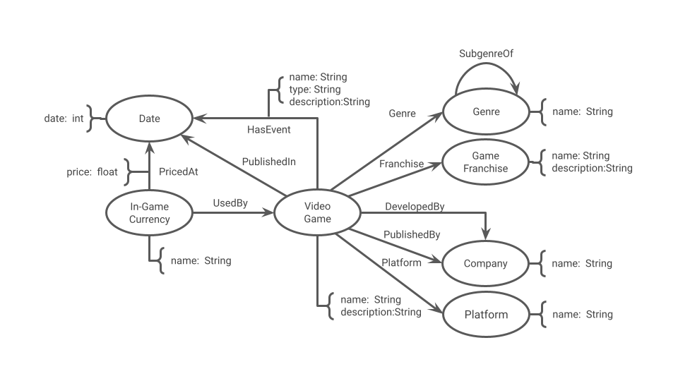

# Aluno
* 236773: Igor Gabriel Cavalcante de Carvalho Borges

## Modelo Lógico do Banco de Dados de Grafos

> 

## Perguntas de Pesquisa/análise

> Baseando-se apenas nos dados presentes na database:
> * Como é o comportamento médio de uma moeda ao longo dos anos desde o lançamento de seu jogo?
> * Alguma(s) das propriedades (gênero, ano, franquia) presentes na database tem efeito perceptível no comportamento de moedas?
> * Podem eventos em um jogo afetar moedas de outros?
